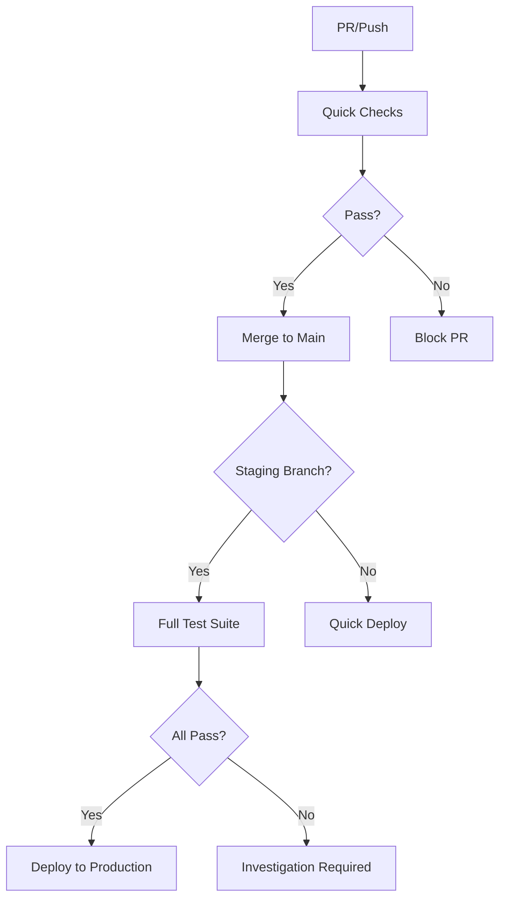

# Testing Architecture & CI/CD Optimization

## Overview

This document outlines the optimized testing strategy implemented to achieve fast, reliable builds while maintaining comprehensive test coverage.

## Testing Strategy Architecture

### 1. Quick Checks (All Branches) - Target: <10 minutes

**Runs on:** All PRs and main branch pushes  
**Purpose:** Fast feedback loop for developers

```yaml
quick-checks:
  - Type checking (tsc --noEmit)
  - Linting (ESLint)
  - Production build validation
  - Smoke tests (essential functionality only)
```

**Scripts:**
- `npm run type-check` - TypeScript validation
- `npm run lint` - Code style and quality
- `npm run build` - Production build test
- `npm run test:smoke` - Critical path testing

### 2. Full Test Suite (Staging Branch Only) - 15-20 minutes

**Runs on:** Only staging branch deployments  
**Purpose:** Comprehensive quality assurance

```yaml
full-tests:
  - Complete E2E test suite
  - Visual regression testing
  - Performance benchmarks
  - Cross-browser compatibility
```

**Scripts:**
- `npm run test:e2e` - Full Playwright test suite
- `npm run test:visual` - Visual regression tests
- `npm run test:performance` - Performance validation

## Test Categories

### Smoke Tests (Fast)
- **Duration:** 2-3 minutes
- **Coverage:** Essential user journeys
- **Files:** `essential-functionality.spec.ts`, `home.spec.ts`
- **Browsers:** Chromium only

#### Smoke Performance Budgets (Enforced in CI)
- **Test:** `tests/e2e/essential-functionality.spec.ts` → `runtime and bundle budgets stay within smoke guardrails`
- **Bundle guardrails (dev server):**
  - Total JS transfer: `<= 35MB`
  - Initial HTML-linked JS transfer: `<= 18MB`
- **Runtime guardrails (renderer-aware):**
  - Constrained/SwiftShader or unknown renderer:
    - FPS `>= 14`
    - Frame time `<= 200ms`
    - Memory `<= 240MB`
    - Audio latency `<= 120ms`
  - Standard renderer:
    - FPS `>= 24`
    - Frame time `<= 55ms`
    - Memory `<= 220MB`
    - Audio latency `<= 100ms`
- **Failure mode:** test exits with a JSON snapshot of renderer, measured values, and violated budget for direct triage.

### E2E Tests (Comprehensive)
- **Duration:** 15-20 minutes
- **Coverage:** All features and user flows
- **Files:** All test files in `tests/e2e/`
- **Browsers:** Chromium, Mobile Chrome, (Firefox/Safari on staging)

### Visual Regression Tests
- **Duration:** 5-10 minutes
- **Coverage:** UI consistency across devices
- **Artifacts:** Screenshots, diff reports
- **Thresholds:** Configurable per component type

## Configuration Optimizations

### Playwright Configuration
- **Reduced timeouts** for CI environments
- **Optimized viewport sizes** for faster rendering
- **Smart browser selection** based on branch
- **Artifact collection** with retention policies

### Build Optimizations
- **Enhanced webpack splitting** for faster loads
- **Aggressive caching** with deterministic IDs
- **SWC minification** for faster builds
- **Dynamic imports** for code splitting

## Artifact Management

### Test Results
- **HTML Reports:** Comprehensive test execution details
- **JUnit XML:** CI/CD integration format
- **JSON Results:** Programmatic analysis

### Visual Assets
- **Screenshots:** Failure debugging and regression baselines
- **Videos:** Full test execution recordings (on failure)
- **Diff Reports:** Visual comparison for UI changes

### Performance Data
- **Metrics:** FPS, load times, memory usage
- **Thresholds:** Automated performance validation
- **Trends:** Historical performance tracking

## CI/CD Pipeline Flow



## Performance Targets

### Build Times
- **Quick Checks:** <10 minutes (target: 5-7 minutes)
- **Full Tests:** <25 minutes (target: 15-20 minutes)
- **Total Pipeline:** <35 minutes from commit to production

### Application Performance
- **Page Load:** <3 seconds initial load
- **Frame Rate:** >60 FPS desktop, >30 FPS mobile
- **Smoke (CI/dev-server) bundle budgets:** <=35MB total JS, <=18MB initial JS
- **Smoke (CI/dev-server) runtime budgets:** renderer-aware thresholds defined in `tests/e2e/essential-functionality.spec.ts`
- **Memory Usage:** <=240MB constrained renderer, <=220MB standard renderer during smoke budgets

## Usage Examples

### Pre-PR Standard
- Run the team checklist before opening a PR: [`docs/pre-pr-checklist.md`](./pre-pr-checklist.md)
- If CI fails, follow the triage drill: [`docs/ci-failure-triage.md`](./ci-failure-triage.md)

### Persistent Controls Access Paths
- Touch: the command deck action rail remains visible across deck states with `Show controls`, `-5 BPM`, `+5 BPM`, and `Mode` actions.
- Mobile sheet snap points: `Hide`, `Peek`, and `Full` provide deterministic bottom-sheet positions.
- Keyboard: `T` toggles deck visibility, `M` cycles mode, `[` lowers tempo by 5 BPM, and `]` raises tempo by 5 BPM.
- Hierarchy: expanded command deck surfaces a `Primary workflow` panel above a subdued `Secondary controls` panel to keep post-start priorities explicit.
- Coverage: verified in `tests/e2e/accessibility.spec.ts` via the `persistent action rail keeps touch and keyboard control paths reachable` test.

### Accessibility Interaction Patterns
- Canonical focus, keyboard-path, and screen-reader announcement rules are documented in `docs/accessibility-patterns.md`.
- Global live-region coverage is asserted in `tests/e2e/accessibility.spec.ts` using `sr-announcer-polite`.

### Tokenized Primitive Coverage
- Primitive architecture reference and adoption rules live in `docs/ui-primitives.md`.
- Start flow and core overlays (`SimpleStartOverlay`, `TelemetryConsentBanner`, `AudioRecoveryBanner`, deck shell) are protected by `tests/e2e/visual-regression.spec.ts`.
- Mobile deck snapshots now suppress telemetry during capture to keep visual baselines deterministic across CI and local runs.
- Epic-level integration status and DoD mapping are tracked in `docs/ui-ux-v2-status.md`.

### Local Development
```bash
# Quick validation before commit
npm run type-check && npm run lint && npm run test:smoke

# Full local testing
npm run test:e2e

# Visual baseline updates
npx playwright test --update-snapshots
```

### CI/CD Integration
```bash
# Quick checks (all branches)
npm ci --legacy-peer-deps
npm run type-check
npm run lint
npm run build
npm run test:smoke

# Full testing (staging only)
npm run test:e2e
npm run test:visual
npm run test:performance
```

## Troubleshooting

### Common Issues
1. **Timeout Errors:** Check server startup and reduce test timeouts
2. **Visual Regression Failures:** Update baselines after UI changes
3. **Performance Degradation:** Profile and optimize heavy operations
4. **Browser Compatibility:** Test across target browser matrix

### Debug Commands
```bash
# Debug specific test
npx playwright test --debug enhanced-features.spec.ts

# View test report
npx playwright show-report

# Trace viewer for failed tests
npx playwright show-trace test-results/trace.zip
```

## Future Enhancements

### Planned Improvements
- **Parallel test execution** for faster completion
- **Smart test selection** based on code changes
- **Performance regression detection** with automatic alerts
- **Visual AI testing** for advanced UI validation

### Monitoring Integration
- **Real-time dashboards** for test health
- **Slack/Teams notifications** for failures
- **Automated performance reports** 
- **Trend analysis** for quality metrics
