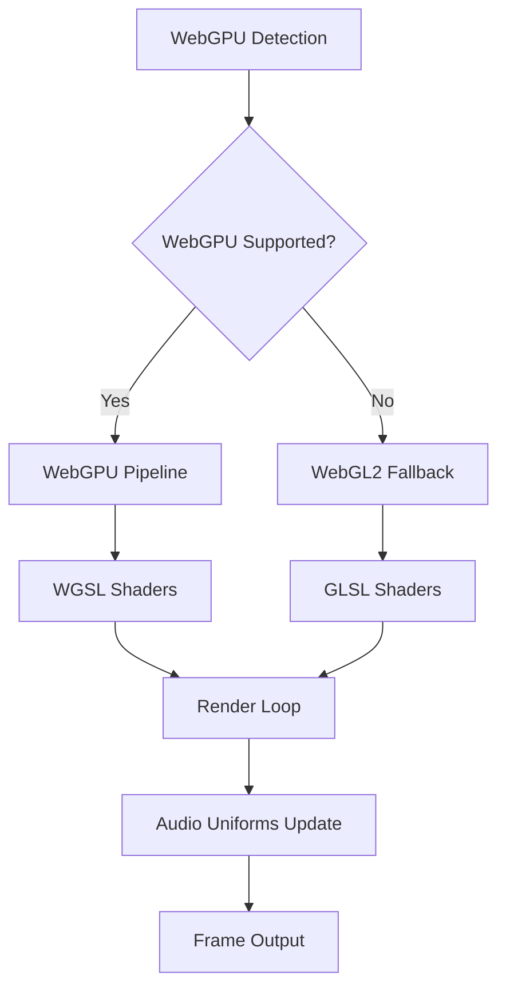
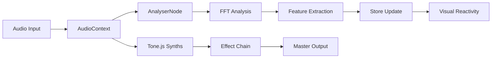
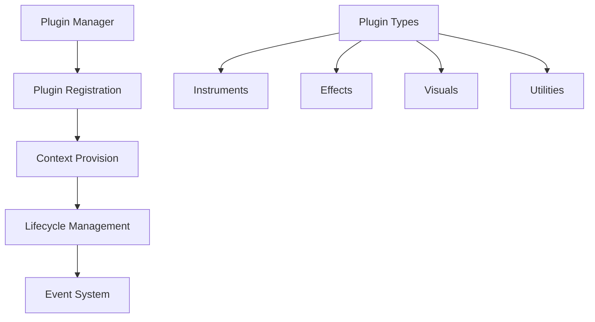

# Architecture Documentation

This document provides a comprehensive overview of the Oscillo platform architecture, performance systems, and plugin ecosystem.

## 🏗️ System Architecture

### Core Stack
- **Frontend**: Next.js 15 with App Router + React 19
- **3D Rendering**: Three.js with WebGPU/WebGL fallbacks
- **Audio Engine**: Tone.js for synthesis + Web Audio API for analysis
- **State Management**: Zustand (primitives only - see store guidelines)
- **Styling**: Tailwind CSS with custom glassmorphism components
- **Animation**: GSAP for performance-critical animations

### Application Structure

```
/app                    # Next.js App Router
├── layout.tsx         # Global layout with error boundaries
├── page.tsx           # Main application entry point
├── ClientLayout.tsx   # Client-side hydration wrapper
└── PluginLoader.tsx   # Dynamic plugin system initialization

/src
├── components/        # React components
│   ├── ui/           # Reusable UI components (glassmorphism)
│   ├── audio/        # Audio controls and visualization
│   ├── visual/       # 3D visual components and shaders
│   └── layout/       # Layout and navigation components
├── lib/              # Core utilities and engines
│   ├── audio.ts      # Tone.js audio engine
│   ├── webgpu-renderer.ts  # WebGPU/WebGL renderer
│   ├── performance-monitor.ts  # Real-time performance tracking
│   └── audio/        # Audio processing utilities
├── store/            # Zustand state management
├── shaders/          # GLSL/WGSL shader files
├── types/            # TypeScript definitions
└── __tests__/        # Unit and integration tests
```

## 🎨 Rendering Pipeline

### WebGPU/WebGL Architecture



### Shader System

The platform includes multiple shader categories:

- **Metaball Shaders** (`metaball.frag`, `metaball.wgsl`)
  - Organic blob animations
  - Audio-reactive morphing
  - Distance field rendering

- **Voronoi Patterns** (`voronoi.frag`, `voronoi.wgsl`)
  - Crystalline geometric patterns
  - Cell-based subdivisions
  - Audio-driven transitions

- **Water Simulation** (`water.frag`, `water-ripple.wgsl`)
  - Realistic fluid dynamics
  - Surface tension effects
  - Audio-triggered ripples

- **Glitch Effects** (`glitch.frag`)
  - Digital corruption aesthetics
  - Datamoshing effects
  - Beat-synchronized distortions

### Audio-Visual Mapping

Shaders receive real-time audio analysis data through uniforms:

```glsl
uniform float u_audioLevel;    // RMS level (0-1)
uniform float u_bass;          // Bass energy (0-1)
uniform float u_mid;           // Mid-range energy (0-1)
uniform float u_treble;        // Treble energy (0-1)
uniform float u_beatIntensity; // Beat detection (0-1)
uniform float u_time;          // Animation time
```

## 🎵 Audio Architecture

### Audio Processing Pipeline



### Audio Features Extracted

- **RMS Level**: Overall audio amplitude
- **Spectral Centroid**: Brightness/timbre
- **Zero Crossing Rate**: Measure of noisiness
- **Frequency Bands**: Bass (20-250Hz), Mid (250-4kHz), Treble (4kHz+)
- **Peak Detection**: Sudden amplitude changes
- **Beat Tracking**: Rhythm analysis

### Effects Chain

Audio flows through a configurable effects chain:

1. **Reverb** - Spatial depth and ambience
2. **Delay** - Echo and rhythmic effects  
3. **Chorus** - Modulation and thickening
4. **Distortion** - Harmonic saturation
5. **Bitcrusher** - Digital degradation

Each effect can be bypassed or automated via audio analysis.

## 📊 Performance Monitoring

### Real-time Metrics

The performance monitor tracks:

- **Frame Rate**: Target 60fps desktop, 30fps mobile
- **Frame Time**: Individual frame duration (target <16.67ms)
- **Memory Usage**: JS heap size and GPU memory
- **Audio Latency**: Round-trip audio processing delay
- **RAF Drift**: RequestAnimationFrame timing variance

### Performance Budgets

Automated budget enforcement:
- FPS: Minimum 30fps sustained
- Memory: Maximum 200MB JS heap
- Audio Latency: Maximum 50ms
- Bundle Size: Initial load <500KB, total <2.5MB

### Adaptive Quality

The system automatically adjusts quality based on performance:

```typescript
// Performance tiers
enum QualityTier {
  ECO,      // Reduced effects, lower resolution
  BALANCED, // Standard settings
  PRO       // Maximum quality
}
```

Quality adjustments include:
- Shader complexity reduction
- Particle count scaling
- Effect chain simplification
- Render resolution adjustment

## 🔌 Plugin System

### Plugin Architecture



### Plugin API

Plugins implement the `Plugin` interface:

```typescript
interface Plugin {
  name: string
  version?: string
  category: 'instrument' | 'effect' | 'visual' | 'utility'
  
  init?: () => Promise<void>
  destroy?: () => Promise<void>
  
  instruments?: InstrumentDefinition[]
  effects?: EffectDefinition[]
  visuals?: VisualDefinition[]
  utilities?: UtilityDefinition[]
}
```

### Plugin Context

Plugins receive a secure context with access to:
- Audio system (AudioContext, Tone.js)
- Visual system (Three.js scene, renderer, camera)
- State management (get/setState)
- Event system (on/off/emit)

### Security Model

Plugins run in a controlled environment:
- No direct DOM access
- Sandboxed state management
- Limited system resource access
- Event-based communication only

## 🛡️ Security Architecture

### Content Security Policy

Strict CSP headers prevent XSS attacks:
- No `eval()` or inline scripts
- Restricted resource origins
- WebGPU/SharedArrayBuffer headers configured

### COEP/COOP Headers

Cross-Origin policies enable advanced features:
- `Cross-Origin-Embedder-Policy: require-corp`
- `Cross-Origin-Opener-Policy: same-origin`

These headers are required for:
- SharedArrayBuffer support
- High-resolution timing
- WebGPU advanced features

### Dependency Security

- Automated vulnerability scanning via Dependabot
- Package overrides for security fixes
- Regular dependency audits
- CodeQL static analysis

## 🚀 Deployment Architecture

### Container Strategy

Multi-stage Docker build:
1. **Base**: Node.js 20 with system dependencies
2. **Dependencies**: npm ci with layer caching
3. **Builder**: Application compilation
4. **Runner**: Production server (non-root user)

### Production Configuration

- Next.js standalone output for minimal runtime
- Health check endpoints for monitoring
- Graceful shutdown handling
- Process signal management

### Container Registry

Automated builds publish to GitHub Container Registry:
- Latest builds on main branch
- Semantic version tags
- Multi-platform support (AMD64, ARM64)
- OCI compliance with metadata

## 📱 Cross-Platform Considerations

### Mobile Optimizations

- Touch gesture recognition
- Reduced shader complexity
- Adaptive quality scaling
- Battery usage optimization

### Browser Compatibility

- WebGPU: Chrome 113+, Firefox 121+, Safari 18+
- WebGL2: Fallback for older browsers
- Web Audio API: Universal support
- Progressive enhancement strategy

### Accessibility Features

- Screen reader compatibility
- Keyboard navigation
- High contrast mode support
- Reduced motion preferences
- ARIA labels and landmarks

## 🧪 Testing Strategy

### Test Architecture

```
Unit Tests (Vitest)
├── Core utilities
├── State management
├── Performance monitoring
└── Audio processing

E2E Tests (Playwright)
├── Smoke tests (CI)
├── Full user journeys
├── Visual regression
├── Performance validation
└── Accessibility compliance

Integration Tests
├── Plugin system
├── Audio-visual mapping
└── State synchronization
```

### Performance Testing

Automated performance validation:
- FPS measurement over time
- Memory leak detection
- Bundle size enforcement
- Accessibility compliance
- Cross-browser compatibility

### CI/CD Pipeline

1. **Pull Request**: Smoke tests + linting
2. **Main Branch**: Full test suite + build
3. **Release Tags**: Performance validation + deployment

## 📈 Monitoring & Observability

### Application Metrics

- Real-time performance overlay
- Error boundary reporting
- User interaction analytics
- Resource usage tracking

### Health Endpoints

- `/api/health`: Basic application health
- `/api/metrics`: Performance metrics
- `/api/webgl-info`: GPU capabilities
- `/api/audio-status`: Audio system status

### Logging Strategy

- Structured JSON logging
- Performance event tracking
- Error aggregation
- User session analytics

## 🔄 State Management

### Zustand Architecture

State is organized into domain-specific stores:

- `useAudioStore`: Real-time audio analysis data
- `useAudioSettings`: User audio preferences
- `useEffectSettings`: Effect chain configuration
- `usePerformance`: Performance monitoring
- `useObjects`: 3D scene object management

### Store Guidelines

**Critical**: Stores must only contain primitives:
- ✅ Strings, numbers, booleans
- ✅ Plain objects and arrays
- ❌ Three.js objects (meshes, materials)
- ❌ Tone.js instances (synths, effects)
- ❌ DOM nodes or React refs

Use IDs to reference complex objects managed elsewhere.

## 🎯 Performance Targets

### Frame Rate
- **Desktop**: Sustained 60fps
- **Mobile**: Sustained 30fps
- **Tolerance**: Occasional drops to 15fps acceptable

### Memory Usage
- **Idle**: <100MB JS heap
- **Active**: <200MB JS heap
- **Peak**: <400MB JS heap (temporary spikes)

### Bundle Size
- **Initial Load**: <500KB gzipped
- **Total Application**: <2.5MB
- **Critical Path**: <100KB

### Audio Latency
- **Target**: <20ms round-trip
- **Acceptable**: <50ms
- **Maximum**: <100ms (degraded experience)

This architecture enables a scalable, performant, and secure interactive music platform with comprehensive monitoring and extensibility.